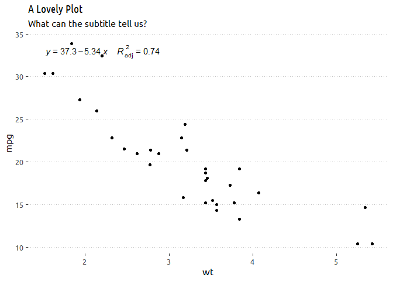

<!-- README.md is generated from README.Rmd. Please edit that file -->

# atslib 

<!-- badges: start -->

<!-- badges: end -->

This is a collection of R functions from [Anatoly
Tsyplenkov](atsyplenkov.com)

## Installation

You can install the development version from
[GitHub](https://github.com/) with:

``` r
# install.packages("devtools")
devtools::install_github("atsyplenkov/atslib")
```

## Example

This is a basic demonstration of using two simple functions from this
package:

``` r
library(atslib)
library(ggplot2)
library(extrafont)
#> Registering fonts with R
## basic example code

ggplot(mtcars, aes(wt, mpg)) +
    geom_point() +
    labs(title = "A Lovely Plot",
         subtitle = "What can the subtitle tell us?") +
    Add_R2() +
    theme_clean()
```


